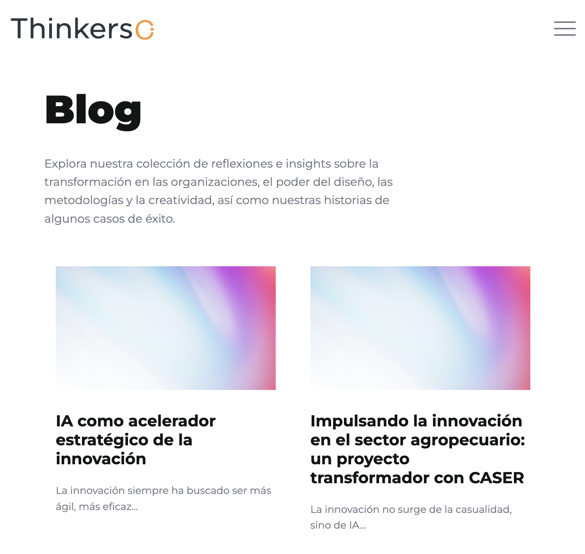

# Blog

# Índice
- [Blog](#blog)
- [Índice](#índice)
  - [Descripción](#descripción)
  - [Tecnologías utilizadas](#tecnologías-utilizadas)
    - [Librerías y plugins](#librerías-y-plugins)
  - [Capturas de pantalla](#capturas-de-pantalla)
    - [Mobile](#mobile)
    - [Tablet](#tablet)
    - [Ordenador](#ordenador)
  - [Estructura relevante](#estructura-relevante)
  - [Estructura de la página](#estructura-de-la-página)
    - [1. Header / Navbar](#1-header--navbar)
    - [2. Sección Blog](#2-sección-blog)
    - [3. CTA (Call To Action)](#3-cta-call-to-action)
    - [4. Footer](#4-footer)
  - [Cómo añadir un nuevo post](#cómo-añadir-un-nuevo-post)
  - [Dependencias JS](#dependencias-js)
  - [Personalización](#personalización)
  - [Licencia](#licencia)

## Descripción

Página de listado de artículos del blog de Thinkers Co. donde se muestran diferentes publicaciones relacionadas con innovación, diseño, estrategia y transformación empresarial.

Incluye:

- Navegación principal del sitio
- Título y pequeña explicación de la página
- Listado de posts en formato grid
- Sección CTA (Call To Action)
- Footer con información de contacto y redes sociales

---

## Tecnologías utilizadas

- HTML5
- CSS3
- JavaScript (vanilla + plugins)
- jQuery

### Librerías y plugins

- Bootstrap
- Swiper.js
- LightGallery
- GSAP (ScrollTrigger, ScrollSmoother, SplitText)
- Isotope

---
## Capturas de pantalla
### Mobile


### Tablet


### Ordenador


---

## Estructura relevante

```bash
assets/
 ├── css/
 │    ├── plugins/
 │    └── style.css
 ├── js/
 │    ├── plugins/
 │    └── main.js
 └── img/

 blogs/
 ├── blog-detalle/    
 └── index.html   
```

---

## Estructura de la página

### 1. Header / Navbar

- Logo
- Menú de navegación principal

### 2. Sección Blog

- Título y descripción
- Grid de artículos
- Cada post contiene:
  - Imagen (thumbnail)
  - Título
  - Extracto
  - Enlace a detalle

### 3. CTA (Call To Action)

Sección para redirigir a contacto:

> Contáctanos →

### 4. Footer

- Información corporativa
- Redes sociales
- Contacto
- Navegación secundaria

---

## Cómo añadir un nuevo post

Duplicar un bloque dentro de:

```html
<div class="cs_featured_cases_grid">
```

Ejemplo:

```html
<div class="cs_featured_case_item">
  <a href="blog-detalle/nuevo-post.html"> <!-- Enlace al archivo de blog-detalle -->
    <div class="cs_post">
      <div class="cs_post_thumb">
        
      </div>
      <div class="cs_post_info">
        <h2 class="cs_post_title">Título del post</h2>
        <p>Descripción corta</p>
      </div>
    </div>
  </a>
</div>
```

---

## Dependencias JS

Incluidas al final del documento:

```html
jquery-3.7.0.min.js
isotope.pkg.min.js
swiper.min.js
lightgallery.min.js
gsap + plugins
main.js
```

---

## Personalización

Se puede modificar:

- El contenido del blog → Editando los bloques HTML
- Los estilos → buscando las clases correspondientes en `assets/css/style.css`
- Las animaciones → `assets/js/main.js` + GSAP

---

## Licencia

Uso interno / proyecto corporativo Thinkers Co.