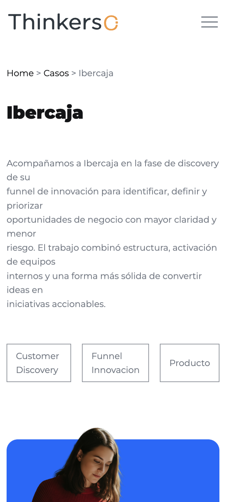
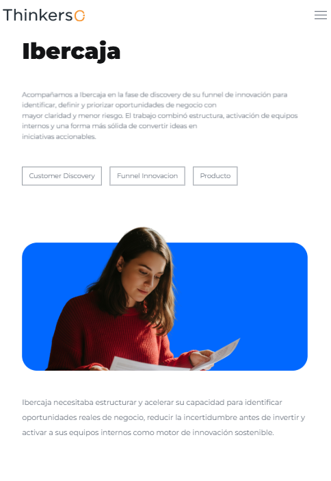
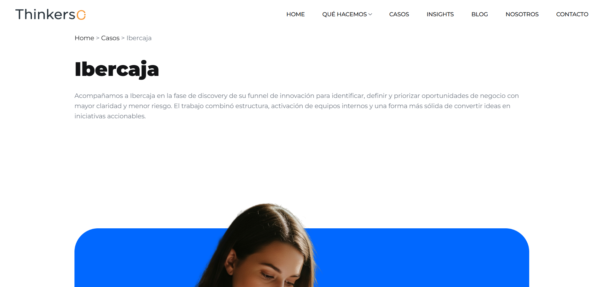
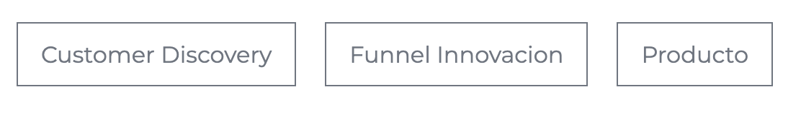

# Caso detalle

# Índice
- [Caso detalle](#caso-detalle)
- [Índice](#índice)
  - [Descripción](#descripción)
  - [Tecnologías utilizadas](#tecnologías-utilizadas)
    - [Librerías y plugins](#librerías-y-plugins)
  - [Capturas de pantalla](#capturas-de-pantalla)
    - [Mobile](#mobile)
    - [Tablet](#tablet)
    - [Ordenador](#ordenador)
  - [Estructura relevante](#estructura-relevante)
  - [Estructura de la página](#estructura-de-la-página)
    - [1. Header / Navbar](#1-header--navbar)
    - [2. Sección Caso](#2-sección-caso)
    - [3. CTA (Call To Action)](#3-cta-call-to-action)
    - [4. Footer](#4-footer)
  - [Funcionamiento breadcrumbs](#funcionamiento-breadcrumbs)
  - [Chips](#chips)
  - [Cita](#cita)
  - [Dependencias JS](#dependencias-js)
  - [Personalización](#personalización)
  - [Licencia](#licencia)

## Descripción

Página de un caso específico de todos los casos de Thinkers Co. donde se muestra la información detallada de dicho caso.

Incluye:
- Navegación principal del sitio
- Breadcrumbs
- Título y descripción del caso
- Sección CTA (Call To Action)
- Footer con información de contacto y redes sociales

---

## Tecnologías utilizadas

- HTML5
- CSS3
- JavaScript (vanilla + plugins)
- jQuery

### Librerías y plugins

- Bootstrap
- Swiper.js
- LightGallery
- GSAP (ScrollTrigger, ScrollSmoother, SplitText)
- Isotope

---
## Capturas de pantalla
### Mobile


### Tablet


### Ordenador


---

## Estructura relevante

```bash
assets/
 ├── css/
 │    ├── plugins/
 │    └── style.css
 ├── js/
 │    ├── plugins/
 │    └── main.js
 └── img/
      └── casos/

 casos/
 ├── caso-detalle/    
 └── index.html   
```

---

## Estructura de la página

### 1. Header / Navbar

- Logo
- Menú de navegación principal

### 2. Sección Caso

- Breadcrumbs
- Título e introducción
- Chips de información
- Imagen
- Descripción del caso
- Cita
- Descripción del caso

### 3. CTA (Call To Action)

Sección para redirigir a contacto:

> Contáctanos →

### 4. Footer

- Información corporativa
- Redes sociales
- Contacto
- Navegación secundaria

---

## Funcionamiento breadcrumbs

Para que los breadcrumbs funcionen hay que seguir 2 pasos:
1. Poner en el html el siguiente bloque:
```html
<section>
  <div class="container">
    <div id="breadcrumb"></div>
  </div>
</section>
```
2. Al final del body añadir este JavaScript:
```js
<script>
    function generarBreadcrumb() {
      const container = document.getElementById("breadcrumb");
      const path = window.location.pathname.split("/").filter(p => p);

      const ignorar = ["insight-detalle", "caso-detalle", "blog-detalle"];

      let rutaAcumulada = "";
      let breadcrumbHTML = '<a href="/">Home</a>';

      const visibles = path.filter(p => !ignorar.includes(p));

      visibles.forEach((segmento, index) => {
        const esUltimo = index === visibles.length - 1;

        rutaAcumulada += "/" + segmento;

        const texto = decodeURIComponent(segmento)
          .replace(".html", "")
          .replace(/[-_]/g, " ")
          .replace(/\b\w/g, l => l.toUpperCase());

        if (esUltimo) {
          breadcrumbHTML += ` > <span>${texto}</span>`;
        } else {
          breadcrumbHTML += ` > <a href="${rutaAcumulada}">${texto}</a>`;
        }
      });

      container.innerHTML = breadcrumbHTML;
    }

    generarBreadcrumb();
  </script>
```
Lo que está haciendo este código es coger la url de la página actual y dividirla cada vez que aparece una barra ``/``.

---

Con la constante  
```js
const ignorar = ["insight-detalle", "caso-detalle", "blog-detalle"];
 ``` 
se ignora cuando en la url aparece alguna de estas cadenas de texto, ya que son carpetas dentro del proyecto pero no son rutas para el usuario.

---

Para que el breadcrumb se vea mejor, se utilizan estas líneas de código para eliminar los ``.html``, Reemplaza guiones y barras bajas por espacios, y pone en mayúscula la primera letra de cada palabra.
```js
const texto = decodeURIComponent(segmento)
  .replace(".html", "")
  .replace(/[-_]/g, " ")
  .replace(/\b\w/g, l => l.toUpperCase());
```

---

Este if else sirve para crear los links de las páginas anteriores, y dejar como texto normal la página en la que te encuentras.
```js
if (esUltimo) {
  breadcrumbHTML += ` > <span>${texto}</span>`;
} else {
  breadcrumbHTML += ` > <a href="${rutaAcumulada}">${texto}</a>`;
}
```

---

## Chips
Para crear un chip es necesario utilizar las clases ``cs_btn cs_style_2``, sin ellas no tendría los estilos de borde y margen aplicados. 
```html
<div class="cs_btn cs_style_2 cs_btn_anim">
     <span class="cs_center chips">Nombre del chip</span>
</div>
```
La clase ``cs_center`` hace que el texto se alinee verticalmente a la caja, y con la clase ``chips`` se le da el tamaño de texto, padding y la alineación horizontal. 

Ejemplo de cómo se ven los chips:


---

## Cita
Para crear/editar una cita hay que usar este elemento:
```html
<div class="container">
     <div class="anim_div_ShowDowns">
     <div class="cs_cita">
          <div class="cs_hr_design"></div>
          <div class="cs_height_40 cs_height_lg_40"></div>
          <div class="anim_div_ShowDowns">
          <p class="cs_cita_text_body cs_font_26">
          “Cita”
          </p>
          </div>
          <div class="cs_height_40 cs_height_lg_40"></div>
          <div class="cs_hr_design"></div>
     </div>
     </div>
</div>
```
Las líneas divisorias están hechas con el div:
```html
<div class="cs_hr_design"></div>
````

Ente las líneas y la cita como tal hay unos divs que sirven para espaciar
```html
<div class="cs_height_40 cs_height_lg_40"></div>
````

Y finalmente se encuentra la cita, que está dentro de un div con la clase ``anim_div_ShowDowns`` para tener animación, y la etiqueta ``p`` de la cita tiene unas clases llamadas ``cs_cita_text_body cs_font_26`` para controlar su estilo (tamaño de la letra, color, etc).

---

## Dependencias JS

Incluidas al final del documento:

```
jquery-3.7.0.min.js
isotope.pkg.min.js
swiper.min.js
lightgallery.min.js
gsap + plugins
main.js
```

---

## Personalización

Se puede modificar:

- El contenido del caso → Editando los bloques HTML
- Los estilos → buscando las clases correspondientes en `assets/css/style.css`
- Las animaciones → `assets/js/main.js` + GSAP

---

## Licencia

Uso interno / proyecto corporativo Thinkers Co.