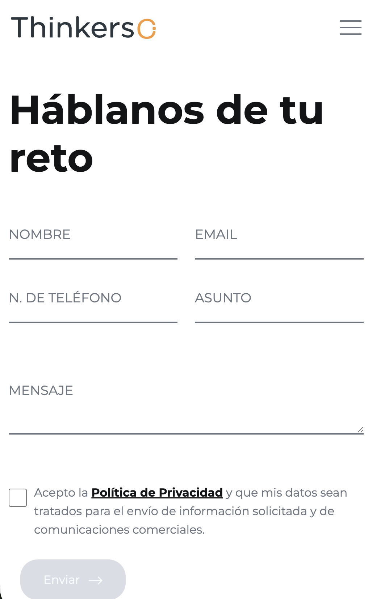
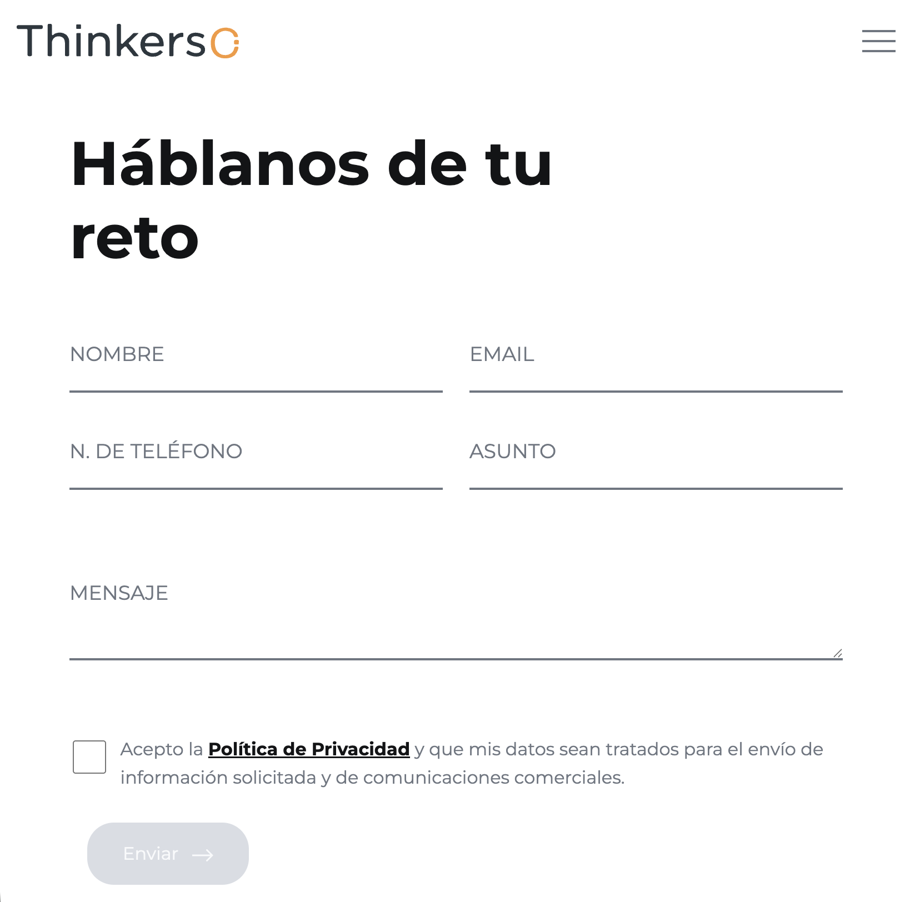
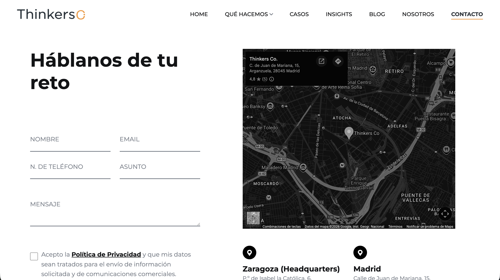

# Contacto

# Índice
- [Contacto](#contacto)
- [Índice](#índice)
  - [Descripción](#descripción)
  - [Tecnologías utilizadas](#tecnologías-utilizadas)
    - [Librerías y plugins](#librerías-y-plugins)
  - [Capturas de pantalla](#capturas-de-pantalla)
    - [Mobile](#mobile)
    - [Tablet](#tablet)
    - [Ordenador](#ordenador)
  - [Estructura relevante](#estructura-relevante)
  - [Estructura de la página](#estructura-de-la-página)
    - [1. Header / Navbar](#1-header--navbar)
    - [2. Sección Háblanos de tu reto](#2-sección-háblanos-de-tu-reto)
    - [3. Footer](#3-footer)
  - [Cómo funciona el formulario con envío email y google sheets](#cómo-funciona-el-formulario-con-envío-email-y-google-sheets)
    - [Pasos para crear el google sheets donde se recibirán los datos](#pasos-para-crear-el-google-sheets-donde-se-recibirán-los-datos)
  - [Dependencias JS](#dependencias-js)
  - [Personalización](#personalización)
  - [Licencia](#licencia)

## Descripción

Página de contactar con la empresa via email a través de un formulario o llamando al teléfono que aparece debajo del mapa.

Para poder enviar el mail a través del formulario se deben rellenar todos los campos y aceptar la política de privacidad.

Incluye:

- Formulario para rellenar con los datos del emisor
- Mapa con una oficina de Thinkers co.
- Información extra sobre las oficinas, número de teléfono y dirección de correo electrónico
- Cláusula de protección de datos
- Footer con información de contacto y redes sociales

---

## Tecnologías utilizadas

- HTML5
- CSS3
- JavaScript (vanilla + plugins)
- jQuery

### Librerías y plugins

- Bootstrap
- Swiper.js
- LightGallery
- GSAP (ScrollTrigger, ScrollSmoother, SplitText)
- Isotope

---
## Capturas de pantalla
### Mobile


### Tablet


### Ordenador


---

## Estructura relevante

```bash
assets/
 ├── css/
 │    ├── plugins/
 │    └── style.css
 └──  js/
      ├── plugins/
      └── main.js

 contacto.html  
```

---

## Estructura de la página

### 1. Header / Navbar

- Logo
- Menú de navegación principal

### 2. Sección Háblanos de tu reto

- Título
- Formulario 
- Mapa
- Chips de información
  - Oficinas
  - Número de teléfono
  - Dirección de correo electrónico
- Cláusula de protección de datos

### 3. Footer

- Información corporativa
- Redes sociales
- Contacto
- Navegación secundaria

---

## Cómo funciona el formulario con envío email y google sheets
Para que los datos del cliente se envíen correctamente al mail y google sheets asignados tienen que estar presentes los siguientes elementos:

 - El id dentro de ``<form method="post" id="contact-form">`` tiene que coincidir con ``const form = document.getElementById("contact-form");`` en el script de "botón enviar clickable" y ``var form = document.getElementById("contact-form");`` en el script de "funcionalidad formulario".

### Pasos para crear el google sheets donde se recibirán los datos

1. Crear un archivo de Google Sheets nuevo y hacer click en **extensiones** → **Apps Script**
  

2. Borrar todo el código por defecto y añadir este:
  
```js
function limpiarTexto(texto) {
  return texto ? texto.toString().replace(/<[^>]*>?/gm, "") : "";
}

function doPost(e) {

  const token = e.parameter.token;

  // TOKEN
  const TOKEN_SECRETO = "abc123456";

  if (token !== TOKEN_SECRETO) {
    return ContentService.createTextOutput("ERROR");
  }

  const sheet = SpreadsheetApp.getActiveSpreadsheet().getActiveSheet();

  // RECIBIR DATOS
  const nombre = e.parameter.nombre;
  const email = e.parameter.email;
  const asunto = e.parameter.asunto;
  const mensaje = e.parameter.mensaje;
  const telefonoRaw = e.parameter.telefono;

  // NORMALIZAR DATOS
  const emailSeguro = limpiarTexto(email).toLowerCase();
  const nombreSeguro = limpiarTexto(nombre);
  const asuntoSeguro = limpiarTexto(asunto);
  const mensajeSeguro = limpiarTexto(mensaje);

  const telefono = telefonoRaw
    ? telefonoRaw.toString().replace(/\s/g, "")
    : "";

  // VALIDACIONES
  if (!emailSeguro || !emailSeguro.includes("@")) {
    return ContentService.createTextOutput("EMAIL_ERROR");
  }

  if (!mensajeSeguro || mensajeSeguro.length < 5) {
    return ContentService.createTextOutput("MENSAJE_ERROR");
  }

  if (telefono && !/^\d+$/.test(telefono)) {
    return ContentService.createTextOutput("PHONE_ERROR");
  }

  // ANTI-SPAM
  const cache = CacheService.getScriptCache();
  const spamKey = emailSeguro;

  if (cache.get(spamKey)) {
    return ContentService.createTextOutput("SPAM");
  }

  cache.put(spamKey, "1", 60);

  // GUARDAR EN GOOGLE SHEETS
  sheet.appendRow([
    nombreSeguro,
    emailSeguro,
    telefono,
    asuntoSeguro,
    mensajeSeguro,
    new Date()
  ]);

  // EMAIL ADMIN
  MailApp.sendEmail({
    to: "EMAIL@thinkersco.com",
    subject: "Nuevo mensaje: " + asuntoSeguro,
    body:
      "Has recibido un nuevo mensaje:\n\n" +
      "Nombre: " + nombreSeguro + "\n" +
      "Email: " + emailSeguro + "\n" +
      "Teléfono: " + telefono + "\n\n" +
      "Mensaje:\n" + mensajeSeguro
  });

  return ContentService.createTextOutput("OK");
}
```

>[!IMPORTANT]Importante
> Cambiar la dirección email a la deseada
```js
MailApp.sendEmail({
    to: "EMAIL@thinkersco.com",
    subject: "Descarga de Insight - " + insightSeguro,
    body:
      "Alguien ha descargado un insight:\n\n" +
      "Nombre: " + nombreSeguro + "\n" +
      "Email: " + emailSeguro + "\n" +
      "Insight descargado: " + insightSeguro
  });
```

3. Hacer click en el botón de arriba a la derecha **Implementar** y seleccionar **Nueva implementación**. Después **Seleccionar tipo** → **Aplicacion web**


4. Añadirle una descripción, ejecutar como **Yo** y permitir acceso a cualquier usuario
   

5. Hacer click en **Implementar**, autorizar acceso y copiar la URL que se genera debajo del título **Aplicación web** (la url debe acabar en ``/exec``)

6. Poner esa url en la parte de código JavaScript de ``contacto.html`` correspondiente:

```html
<!-- Funcionalidad formulario -->
  <script>
    const form = document.getElementById("contact-form");
    const estado = document.getElementById("estado");

    const URL = "PEGAR URL AQUÍ";

```

>[!NOTE]Nota
> El código analiza si el cliente ha enviado carácteres <> y rechaza el envío en su caso.


> [!NOTE]Nota
> También comprueba que el email contenga ``@``, que el mensaje tenga más de 5 caracteres y que el número de teléfono sea numérico.


>[!NOTE]Nota
> Tiene un pequeño control de Spam para que la misma dirección de correo electrónico no pueda enviar muchos mails en un determinado periodo de tiempo (en este caso 60 segundos)
```js
const cache = CacheService.getScriptCache();
  const spamKey = emailSeguro;

  if (cache.get(spamKey)) {
    return ContentService.createTextOutput("SPAM");
  }

  cache.put(spamKey, "1", 60);
```
  Apps Script ⤴

---

## Dependencias JS

Incluidas al final del documento:

```
jquery-3.7.0.min.js
isotope.pkg.min.js
swiper.min.js
lightgallery.min.js
gsap + plugins
main.js
```

---

## Personalización

Se puede modificar:

- El contenido de la página → Editando los bloques HTML
- Los estilos → buscando las clases correspondientes en `assets/css/style.css`
- Las animaciones → `assets/js/main.js` + GSAP


>[!NOTE]Nota
> La clase "error" en el script es la que hace que cambie el color de texto a rojo cuando hay un error en el envío del formulario.
---

## Licencia

Uso interno / proyecto corporativo Thinkers Co.