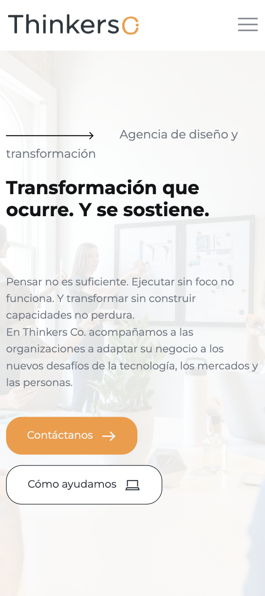
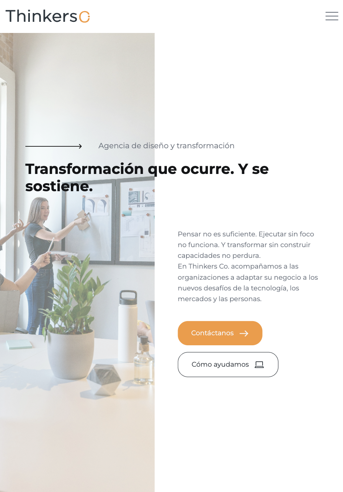
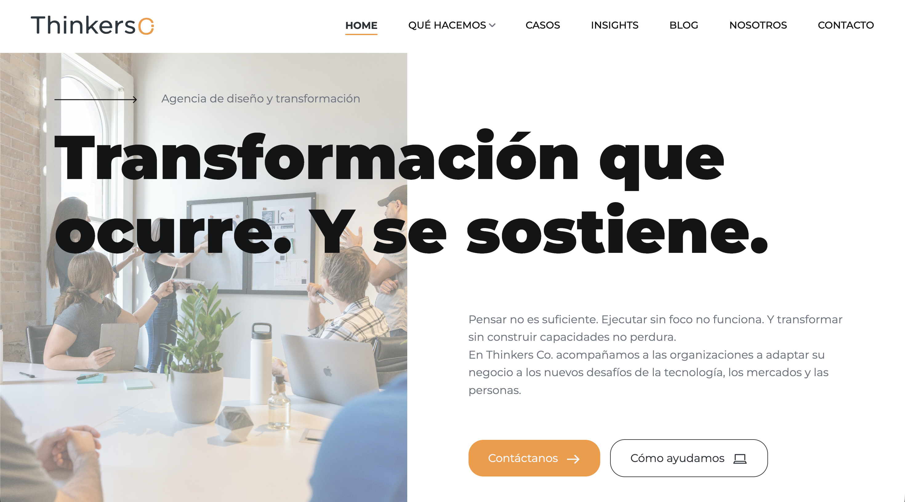

# Home 

# Índice
- [Home](#home)
- [Índice](#índice)
  - [Descripción](#descripción)
  - [Tecnologías utilizadas](#tecnologías-utilizadas)
    - [Librerías y plugins](#librerías-y-plugins)
  - [Capturas de pantalla](#capturas-de-pantalla)
    - [Mobile](#mobile)
    - [Tablet](#tablet)
    - [Ordenador](#ordenador)
  - [Estructura relevante](#estructura-relevante)
  - [Estructura de la página](#estructura-de-la-página)
    - [1. Header / Navbar](#1-header--navbar)
    - [2. Hero](#2-hero)
    - [3. Logos de clientes / partners](#3-logos-de-clientes--partners)
    - [4. Propuesta de valor](#4-propuesta-de-valor)
    - [5. Reenfoque](#5-reenfoque)
    - [6. Cómo podemos ayudarte](#6-cómo-podemos-ayudarte)
    - [7. Ejes de actuación](#7-ejes-de-actuación)
    - [8. Casos destacados](#8-casos-destacados)
    - [9. Insights](#9-insights)
    - [10. CTA (Call To Action)](#10-cta-call-to-action)
    - [11. Footer](#11-footer)
  - [Cómo añadir un nuevo reenfoque](#cómo-añadir-un-nuevo-reenfoque)
  - [Cómo añadir una nueva tarjeta en "como podemos ayudarte"](#cómo-añadir-una-nueva-tarjeta-en-como-podemos-ayudarte)
  - [Cómo añadir un nuevo eje de actuación](#cómo-añadir-un-nuevo-eje-de-actuación)
  - [Cómo añadir un nuevo caso destacado](#cómo-añadir-un-nuevo-caso-destacado)
  - [Dependencias JS](#dependencias-js)
  - [Personalización](#personalización)
    - [Funcionamiento de las clases botón (btn)](#funcionamiento-de-las-clases-botón-btn)
  - [Licencia](#licencia)

## Descripción

Página principal del sitio web de la empresa. Actúa como punto de entrada y presentación general de la marca, mostrando su propuesta de valor, servicios principales, casos destacados e insights.

Su objetivo es comunicar de forma clara la identidad de la empresa y guiar al usuario hacia las distintas secciones del sitio.

Incluye:
- Hero con propuesta de valor principal
- Logos de clientes/partners
- Sección de propuesta de valor
- Bloque de “reenfoque”
- Sección “cómo podemos ayudarte”
- Ejes de actuación
- Casos destacados
- Insights
- Sección CTA (Call To Action)
- Footer con información de contacto y redes sociales

---

## Tecnologías utilizadas

- HTML5
- CSS3
- JavaScript (vanilla + plugins)
- jQuery

### Librerías y plugins

- Bootstrap
- Swiper.js
- LightGallery
- GSAP (ScrollTrigger, ScrollSmoother, SplitText)
- Isotope

---
## Capturas de pantalla
### Mobile


### Tablet


### Ordenador


---

## Estructura relevante

```bash
assets/
 ├── css/
 │    ├── plugins/
 │    └── style.css
 ├── js/
 │    ├── plugins/
 │    └── main.js
 └── img/home/
      └── partners/

 index.html  
```

---

## Estructura de la página

### 1. Header / Navbar

- Logo
- Menú de navegación principal

### 2. Hero

- Título y mensaje principal de la marca
- Subtítulo explicativo
- CTA principal (Contacto / Servicios)
- Imagen

### 3. Logos de clientes / partners
Carrusel animado de marcas colaboradoras.


### 4. Propuesta de valor

- Explicación del enfoque de la empresa
- Diferenciación frente al mercado
- Mensaje estratégico principal

### 5. Reenfoque

- Problemas habituales del sector:
  - Falta de acción
  - Desalineación en la ejecución
  - Resistencia al cambio
  - Dependencia externa
- Introducción al enfoque de la empresa

### 6. Cómo podemos ayudarte

- Beneficios clave del servicio:
  - Transformación real
  - Innovación con foco
  - Ejecución alineada
  - Adopción del cambio
  - Desarrollo de capacidades internas

### 7. Ejes de actuación

- Thinkers Lab (exploración)
- Thinkers Drive (ejecución)
- Thinkers Capacity (capacitación)

### 8. Casos destacados

- Proyectos reales con clientes
- Descripción breve de impacto por cliente
- Enlace a listado completo de casos

### 9. Insights

- Contenidos editoriales / artículos
- Tendencias y aprendizaje
- Slider con destacados

### 10. CTA (Call To Action)

Sección para redirigir a contacto:

> Contáctanos →


### 11. Footer

- Información corporativa
- Redes sociales
- Contacto
- Navegación secundaria

---

## Cómo añadir un nuevo reenfoque

Poner dentro del div: 
```html
<div class="row reenfoque anim_div_ShowLeftSide">
```
el siguiente bloque:
```html
<div class="col-md-3 col-12">
    <div class="cs_stroke_text">
        <span class="cs_font_50">Número</span>
    </div>
    <div class="text-section">
        <h6>Título/Nombre</h6>
    </div>
</div>
```


---

## Cómo añadir una nueva tarjeta en "como podemos ayudarte"

Poner dentro del div: 
```html
<div class="row g-4 cs_help_cards">
```
el siguiente bloque:
```html
<div class="col-lg-4 col-md-6 col-12">
    <div class="cs_startup_agency cs_card">
        <h6>Título</h6>
        <p class="cs_font_16 cs_mp0">
            Descripción
        </p>
    </div>
</div>
```

---

## Cómo añadir un nuevo eje de actuación

Poner dentro del div: 
```html
<div class="cs_card_1_list">
```
el siguiente bloque:
```html
<a href="" class="cs_card cs_style_1 card_link cs_color_1 anim_div_ShowDowns">
    <div class="cs_card_left">
        <div class="cs_card_number cs_primary_font">
            Número
        </div>
    </div>
    <div class="cs_card_right">
        <div class="cs_card_right_in">
            <h2 class="cs_card_title">
                Título del eje
            </h2>
            <div class="cs_card_subtitle">
                Descripción del eje de actuación.
            </div>
        </div>
    </div>
</a>
```

---

## Cómo añadir un nuevo caso destacado

Poner dentro del div: 
```html
<div class="cs_featured_cases_grid">
```
el siguiente bloque:
```html
<div class="cs_featured_case_item cs_color_1 anim_div_ShowDowns">
    <div class="cs_post cs_style_1">
        <div class="cs_post_thumb post_logo">
            
        </div>
        <div class="cs_post_info">
            <p class="cs_m0">
                Breve descripción del caso.
            </p>
        </div>
    </div>
</div>
```
> [!NOTE]Nota  
> La imagen actúa como título y esta debe ser de 16:9


---

## Dependencias JS

Incluidas al final del documento:

```
jquery-3.7.0.min.js
isotope.pkg.min.js
swiper.min.js
lightgallery.min.js
gsap + plugins
main.js
```

---

## Personalización

Se puede modificar:

- El contenido de la página → Editando los bloques HTML
- Los estilos → buscando las clases correspondientes en `assets/css/style.css`
- Las animaciones → `assets/js/main.js` + GSAP


### Funcionamiento de las clases botón (btn)
Cada botón debe tener tanto la clase ``btn`` como la ``btn_primary`` / ``btn_secondary`` / ``btn_tertiary``.

La clase ``btn`` sirve para darle forma al botón, ajustar margenes, etc. Mientras que las clases ``btn_primary`` / ``btn_secondary`` / ``btn_tertiary`` sirven para darle los colores distintivos.

Por ejemplo:
```css
.btn {
    padding: 16px 32px;
    margin-left: 0;
    display: inline-block;
    border-radius: 24px;
    transition: background-color 0.3s ease, border-color 0.3s ease, color 0.3s ease, padding-right 0.3s ease;
    margin: 1rem;
    border: 0;
}
```

```css
.btn_primary {
    background-color: var(--default-btn-primary);
    color: var(--btn-primary-color);
}
```
Aquí se le están asignando al color de fondo y al color de texto las variables creadas al inicio del documento ``style.css``.


---

## Licencia

Uso interno / proyecto corporativo Thinkers Co.