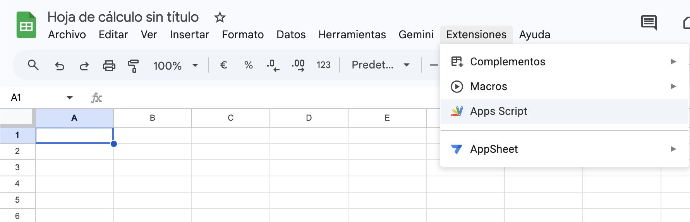
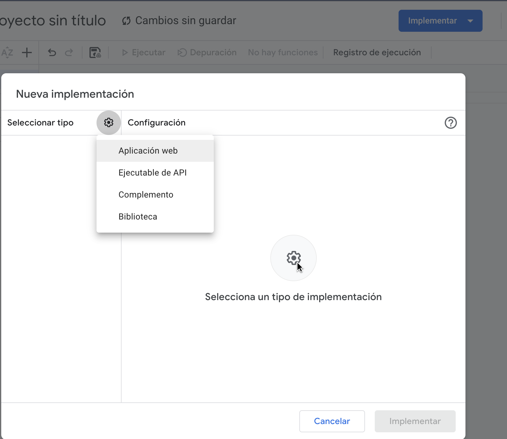
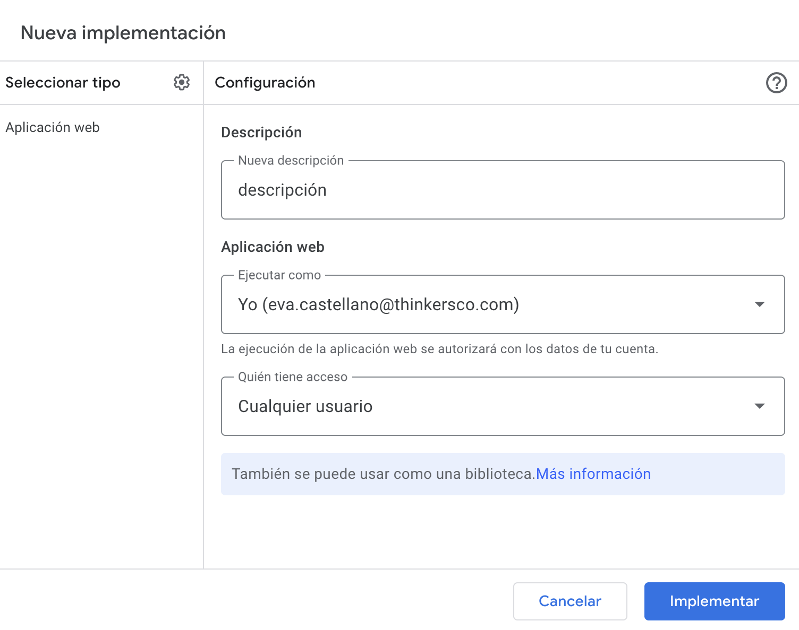

# Insight detalle

# Índice
- [Insight detalle](#insight-detalle)
- [Índice](#índice)
  - [Descripción](#descripción)
  - [Tecnologías utilizadas](#tecnologías-utilizadas)
    - [Librerías y plugins](#librerías-y-plugins)
  - [Capturas de pantalla](#capturas-de-pantalla)
    - [Mobile](#mobile)
    - [Tablet](#tablet)
    - [Ordenador](#ordenador)
  - [Estructura relevante](#estructura-relevante)
  - [Estructura de la página](#estructura-de-la-página)
    - [1. Header / Navbar](#1-header--navbar)
    - [2. Insight](#2-insight)
    - [3. Descarga](#3-descarga)
    - [4. CTA (Call To Action)](#4-cta-call-to-action)
    - [5. Footer](#5-footer)
  - [Cómo funciona la descarga de pdf y el envío de datos a google sheets y mail](#cómo-funciona-la-descarga-de-pdf-y-el-envío-de-datos-a-google-sheets-y-mail)
  - [Funcionamiento breadcrumbs](#funcionamiento-breadcrumbs)
  - [Dependencias JS](#dependencias-js)
  - [Personalización](#personalización)
  - [Licencia](#licencia)

## Descripción

Página de un caso específico de todos los casos de Thinkers Co. donde se muestra la información detallada de dicho caso.

Incluye:
- Navegación principal del sitio
- Breadcrumbs
- Imagen
- Título y descripción del insight
- Slider con propuestas de valor
- Sección con formulario para descargar el pdf del insight
- Sección CTA (Call To Action)
- Footer con información de contacto y redes sociales

---

## Tecnologías utilizadas

- HTML5
- CSS3
- JavaScript (vanilla + plugins)
- jQuery

### Librerías y plugins

- Bootstrap
- Swiper.js
- LightGallery
- GSAP (ScrollTrigger, ScrollSmoother, SplitText)
- Isotope

---
## Capturas de pantalla
### Mobile


### Tablet


### Ordenador


---

## Estructura relevante

```bash
assets/
 ├── css/
 │    ├── plugins/
 │    └── style.css
 └── js/
      ├── plugins/
      └── main.js
 
insights/ 
 ├── insights-detalle/
 ├── insight-pdfs/
 └── index.html  
```

---

## Estructura de la página

### 1. Header / Navbar

- Logo
- Menú de navegación principal

### 2. Insight

- Breadcrumbs
- Imagen
- Título e introducción
- Slider con propuestas de valor

### 3. Descarga

- Formulario con datos del usuario (obligatorio rellenar todos los campos)
- Botón de descargar informe
  - Los pdf a descargar se almacenan en la carpeta ``inights-pdfs`` dentro de la carpeta ``insights``

### 4. CTA (Call To Action)

Sección para redirigir a contacto:

> Contáctanos →

### 5. Footer

- Información corporativa
- Redes sociales
- Contacto
- Navegación secundaria

---

## Cómo funciona la descarga de pdf y el envío de datos a google sheets y mail

1. Este es el formulario utilizado para el envío del mail y rellenado de google sheets, a su vez que el cliente descarga desde aquí el pdf.
```html
<form method="post" id="contact-form" class="cs_insight_download_form">
  <div class="form_insight">
    <div class="cs_field_group col">
      <input class="cs_input_field" type="text" id="test1" placeholder="Name" name="nombre" required />
      <label for="test1" class="cs_input_label">Nombre</label>
    </div>
    <div class="cs_field_group col">
      <input class="cs_input_field" type="email" id="test2" placeholder="Name" name="email" required />
      <label for="test2" class="cs_input_label">Email</label>
    </div>

    <input type="hidden" name="token" value="th1nk3r5-t0k3n">

    <!-- Boton descargar informe -->
    <div class="col cs_download_button_col">
      <button type="submit" class="btn btn_primary" id="contact-submit" style="margin-left: 0;" disabled>
        <span>Descargar informe</span>

        <!-- Icono flecha -->
        <svg width="24" height="24" viewBox="0 0 24 24" fill="none" xmlns="http://www.w3.org/2000/svg">
          <path d="M12 3V16" stroke="#F5F7FA" stroke-width="2" stroke-linecap="square" />
          <path d="M7 12L12 17L17 12" stroke="#F5F7FA" stroke-width="2" stroke-linecap="square" />
          <path d="M20 21H4" stroke="#F5F7FA" stroke-width="2" stroke-linecap="square" />
        </svg>

      </button>
      <p id="mensaje" class="error"></p>
    </div>
  </div>
</form>
```

1. Crear un archivo de Google Sheets nuevo y hacer click en **extensiones** → **Apps Script**
  

2. Borrar todo el código por defecto y añadir este:
```js
function limpiarTexto(texto) {
  return texto ? texto.toString().replace(/<[^>]*>?/gm, "") : "";
}

function doPost(e) {

  const token = e.parameter.token;

  // TOKEN SECRETO
  const TOKEN_SECRETO = "th1nk3r5-t0k3n";

  if (token !== TOKEN_SECRETO) {
    return ContentService.createTextOutput("ERROR");
  }

  const sheet = SpreadsheetApp.getActiveSpreadsheet().getActiveSheet();

  // RECIBIR DATOS
  const nombre = e.parameter.nombre;
  const email = e.parameter.email;
  const insight = e.parameter.insight;

  // NORMALIZAR DATOS
  const nombreSeguro = limpiarTexto(nombre);
  const emailSeguro = limpiarTexto(email).toLowerCase();
  const insightSeguro = limpiarTexto(insight);

  // VALIDACIONES
  if (!emailSeguro || !emailSeguro.includes("@")) {
    return ContentService.createTextOutput("EMAIL_ERROR");
  }

  // ANTI-SPAM (1 envío por email cada 60s)
  const cache = CacheService.getScriptCache();
  const spamKey = emailSeguro;

  if (cache.get(spamKey)) {
    return ContentService.createTextOutput("SPAM");
  }

  cache.put(spamKey, "1", 60);

  // GUARDAR EN GOOGLE SHEETS
  sheet.appendRow([
    nombreSeguro,
    emailSeguro,
    insightSeguro,
    new Date()
  ]);

  // EMAIL ADMIN
  MailApp.sendEmail({
    to: "EMAIL@thinkersco.com",
    subject: "Descarga de Insight - " + insightSeguro,
    body:
      "Alguien ha descargado un insight:\n\n" +
      "Nombre: " + nombreSeguro + "\n" +
      "Email: " + emailSeguro + "\n" +
      "Insight descargado: " + insightSeguro
  });

  return ContentService.createTextOutput("OK");
}
```
>[!IMPORTANT]Importante
> Cambiar la dirección email a la deseada
```js
MailApp.sendEmail({
    to: "EMAIL@thinkersco.com",
    subject: "Descarga de Insight - " + insightSeguro,
    body:
      "Alguien ha descargado un insight:\n\n" +
      "Nombre: " + nombreSeguro + "\n" +
      "Email: " + emailSeguro + "\n" +
      "Insight descargado: " + insightSeguro
  });
```
3. Hacer click en el botón de arriba a la derecha **Implementar** y seleccionar **Nueva implementación**. Después **Seleccionar tipo** → **Aplicacion web**


4. Añadirle una descripción, ejecutar como **Yo** y permitir acceso a cualquier usuario
   

5. Hacer click en **Implementar**, autorizar acceso y copiar la URL que se genera debajo del título **Aplicación web** (la url debe acabar en ``/exec``)

6. Poner el siguiente script en el final de la página de ``insight-detalle.html``:

```html
<script>
  document.addEventListener("DOMContentLoaded", function () {

    var form = document.getElementById("contact-form");
    var submitButton = document.getElementById("contact-submit");

    if (!form || !submitButton) return;
    /* Ruta donde está almacenado el pdf */
    var pdfUrl = "/insight-pdfs/Informe 1_Thinkers Insights Series_El nuevo consumo_Dossier.pdf";

    /* Enlace Apps Script */
    var appsScriptUrl = "PEGAR URL AQUÍ";

    var requiredFields = form.querySelectorAll("input[required]");

    function isFieldCompleted(field) {
      if (field.type === "checkbox") return field.checked;
      return field.value.trim() !== "" && field.checkValidity();
    }

    function updateSubmitState() {
      var isFormComplete = Array.from(requiredFields).every(isFieldCompleted);
      submitButton.disabled = !isFormComplete;
    }

    requiredFields.forEach(function (field) {
      field.addEventListener("input", updateSubmitState);
      field.addEventListener("change", updateSubmitState);
    });

    form.addEventListener("submit", async function (event) {
      event.preventDefault();

      if (submitButton.disabled) return;

      /* texto original del botón */
      var originalText = submitButton.innerHTML;

      var nameInput = form.querySelector('input[name="nombre"]');

      // validacion que el input "nombre" no contenga < ni >
      if (nameInput && /[<>]/.test(nameInput.value)) {
        mensaje.innerText = "Error: no se pueden introducir los símbolos < o >";

        setTimeout(() => {
        mensaje.innerText = "";
      }, 10000);
        return;
      }

      submitButton.disabled = true;
      submitButton.innerHTML = "Descargando...";

      try {
        var formData = new FormData(form);

        var res = await fetch(appsScriptUrl, {
          method: "POST",
          body: formData
        });

        var response = await res.text();

        if (response === "OK") {

          var downloadLink = document.createElement("a");
          downloadLink.href = pdfUrl;
          downloadLink.download = "Informe Insight 1 - El nuevo consumo.pdf";

          document.body.appendChild(downloadLink);
          downloadLink.click();
          document.body.removeChild(downloadLink);

        } else {
          console.error("Error Apps Script:", response);
        }

      } catch (err) {
        console.error("Fetch error:", err);
      } finally {
        submitButton.disabled = false;
        submitButton.innerHTML = originalText;
      }

    });

    updateSubmitState();
  });
</script>
```
7. poner la url generada en el paso 5 en esta linea de código:
```js
/* Enlace Apps Script */
var appsScriptUrl = "PEGAR URL AQUÍ";
```

>[!NOTE]Nota
> El código analiza si el cliente ha enviado carácteres <> y rechaza el envío en su caso. 
> 
> También comprueba que el email contenga ``@``.

>[!NOTE]Nota
> Tiene un pequeño control de Spam para que la misma dirección de correo electrónico no pueda enviar muchos mails en un determinado periodo de tiempo (en este caso 60 segundos)
```js
const cache = CacheService.getScriptCache();
  const spamKey = emailSeguro;

  if (cache.get(spamKey)) {
    return ContentService.createTextOutput("SPAM");
  }

  cache.put(spamKey, "1", 60);
```
  Apps Script ⤴

---

## Funcionamiento breadcrumbs

Para que los breadcrumbs funcionen hay que seguir 2 pasos:
1. Poner en el html el siguiente bloque:
```html
<section>
  <div class="container">
    <div id="breadcrumb"></div>
  </div>
</section>
```
2. Al final del body añadir este JavaScript:
```js
<script>
    function generarBreadcrumb() {
      const container = document.getElementById("breadcrumb");
      const path = window.location.pathname.split("/").filter(p => p);

      const ignorar = ["insight-detalle", "caso-detalle", "blog-detalle"];

      let rutaAcumulada = "";
      let breadcrumbHTML = '<a href="/">Home</a>';

      const visibles = path.filter(p => !ignorar.includes(p));

      visibles.forEach((segmento, index) => {
        const esUltimo = index === visibles.length - 1;

        rutaAcumulada += "/" + segmento;

        const texto = decodeURIComponent(segmento)
          .replace(".html", "")
          .replace(/[-_]/g, " ")
          .replace(/\b\w/g, l => l.toUpperCase());

        if (esUltimo) {
          breadcrumbHTML += ` > <span>${texto}</span>`;
        } else {
          breadcrumbHTML += ` > <a href="${rutaAcumulada}">${texto}</a>`;
        }
      });

      container.innerHTML = breadcrumbHTML;
    }

    generarBreadcrumb();
  </script>
```
Lo que está haciendo este código es coger la url de la página actual y dividirla cada vez que aparece una barra ``/``.

---

Con la constante  
```js
const ignorar = ["insight-detalle", "caso-detalle", "blog-detalle"];
 ``` 
se ignora cuando en la url aparece alguna de estas cadenas de texto, ya que son carpetas dentro del proyecto pero no son rutas para el usuario.

---

Para que el breadcrumb se vea mejor, se utilizan estas líneas de código para eliminar los ``.html``, Reemplaza guiones y barras bajas por espacios, y pone en mayúscula la primera letra de cada palabra.
```js
const texto = decodeURIComponent(segmento)
  .replace(".html", "")
  .replace(/[-_]/g, " ")
  .replace(/\b\w/g, l => l.toUpperCase());
```

---

Este if else sirve para crear los links de las páginas anteriores, y dejar como texto normal la página en la que te encuentras.
```js
if (esUltimo) {
  breadcrumbHTML += ` > <span>${texto}</span>`;
} else {
  breadcrumbHTML += ` > <a href="${rutaAcumulada}">${texto}</a>`;

```

---

## Dependencias JS

Incluidas al final del documento:

```
jquery-3.7.0.min.js
isotope.pkg.min.js
swiper.min.js
lightgallery.min.js
gsap + plugins
main.js
```

---

## Personalización

Se puede modificar:

- El contenido de la página → Editando los bloques HTML
- Los estilos → buscando las clases correspondientes en `assets/css/style.css`
- Las animaciones → `assets/js/main.js` + GSAP

---

## Licencia

Uso interno / proyecto corporativo Thinkers Co.