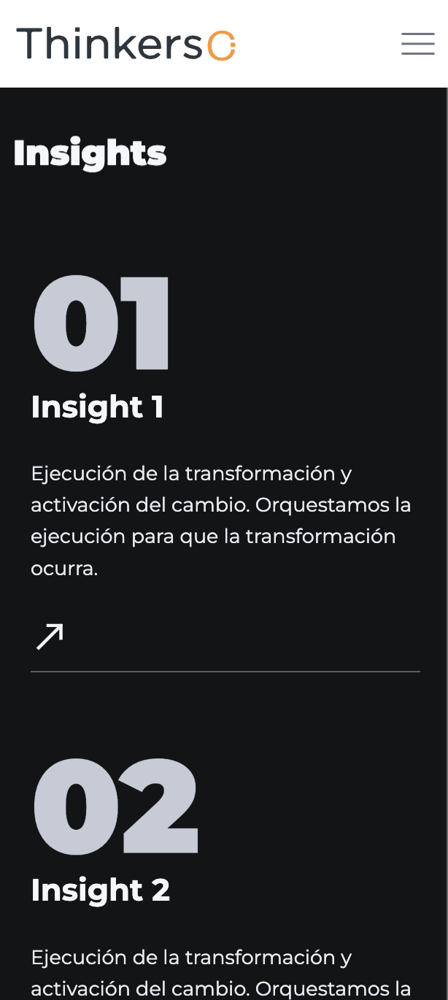
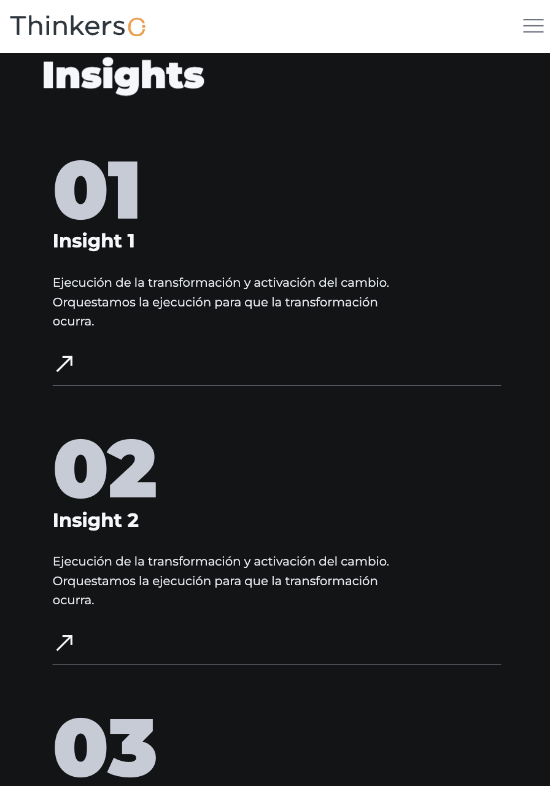
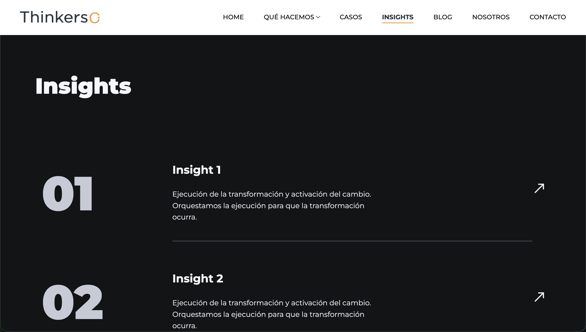

# Qué hacemos

# Índice
- [Qué hacemos](#qué-hacemos)
- [Índice](#índice)
  - [Descripción](#descripción)
  - [Tecnologías utilizadas](#tecnologías-utilizadas)
    - [Librerías y plugins](#librerías-y-plugins)
  - [Capturas de pantalla](#capturas-de-pantalla)
    - [Mobile](#mobile)
    - [Tablet](#tablet)
    - [Ordenador](#ordenador)
  - [Estructura relevante](#estructura-relevante)
  - [Estructura de la página](#estructura-de-la-página)
    - [1. Header / Navbar](#1-header--navbar)
    - [2. Insights](#2-insights)
    - [3. CTA (Call To Action)](#3-cta-call-to-action)
    - [4. Footer](#4-footer)
  - [Cómo añadir un nuevo insight](#cómo-añadir-un-nuevo-insight)
  - [Dependencias JS](#dependencias-js)
  - [Personalización](#personalización)
  - [Licencia](#licencia)

## Descripción

Página enfocada en explicar los insights principales de la empresa.

Incluye:
- Navegación principal del sitio
- Sección de insights con enlaces
- Sección CTA (Call To Action)
- Footer con información de contacto y redes sociales

---

## Tecnologías utilizadas

- HTML5
- CSS3
- JavaScript (vanilla + plugins)
- jQuery

### Librerías y plugins

- Bootstrap
- Swiper.js
- LightGallery
- GSAP (ScrollTrigger, ScrollSmoother, SplitText)
- Isotope

---
## Capturas de pantalla
### Mobile


### Tablet


### Ordenador


---

## Estructura relevante

```bash
assets/
 ├── css/
 │    ├── plugins/
 │    └── style.css
 └── js/
      ├── plugins/
      └── main.js
 
insights/ 
 ├── insights-detalle/
 ├── insight-pdfs/
 └── index.html
```

---

## Estructura de la página

### 1. Header / Navbar

- Logo
- Menú de navegación principal

### 2. Insights

- Título
- Listado de insights
  - Insight 1
  - Insight 2
  - Insight 3


### 3. CTA (Call To Action)

Sección para redirigir a contacto:

> Contáctanos →

### 4. Footer

- Información corporativa
- Redes sociales
- Contacto
- Navegación secundaria

---

## Cómo añadir un nuevo insight

Poner dentro del div: 
```html
<div class="cs_card_1_list">
```
el siguiente bloque:
```html
<a href="enlace-a-insight-detalle.html" class="cs_card cs_style_1 card_link cs_color_1 anim_div_ShowDowns">
    <div class="cs_card_left">
        <div class="cs_card_number cs_primary_font">
        Número
        </div>
    </div>
    <div class="cs_card_right">
        <div class="cs_card_right_in">
        <h2 class="cs_card_title">
            Título
        </h2>
        <div class="cs_card_subtitle">
            Descripción breve
        </div>
        </div>
    </div>
    <div class="cs_card_link_wrap cs_card_link">
        <span>
        <svg width="35" height="35" viewBox="0 0 24 24" fill="none" xmlns="http://www.w3.org/2000/svg">
            <path d="M19 13V5H11" stroke="#F5F7FA" stroke-width="2" stroke-linecap="square" />
            <path d="M19 5L18 6" stroke="#F5F7FA" stroke-width="2" stroke-linecap="round" />
            <path d="M18 6L5 19" stroke="#F5F7FA" stroke-width="2" stroke-linecap="square" />
        </svg>
        </span>
        <span>
        <svg width="35" height="35" viewBox="0 0 24 24" fill="none" xmlns="http://www.w3.org/2000/svg">
            <path d="M19 13V5H11" stroke="#F5F7FA" stroke-width="2" stroke-linecap="square" />
            <path d="M19 5L18 6" stroke="#F5F7FA" stroke-width="2" stroke-linecap="round" />
            <path d="M18 6L5 19" stroke="#F5F7FA" stroke-width="2" stroke-linecap="square" />
        </svg>
        </span>
    </div>
</a>
```


---

## Dependencias JS

Incluidas al final del documento:

```
jquery-3.7.0.min.js
isotope.pkg.min.js
swiper.min.js
lightgallery.min.js
gsap + plugins
main.js
```

---

## Personalización

Se puede modificar:

- El contenido de la página → Editando los bloques HTML
- Los estilos → buscando las clases correspondientes en `assets/css/style.css`
- Las animaciones → `assets/js/main.js` + GSAP

---

## Licencia

Uso interno / proyecto corporativo Thinkers Co.