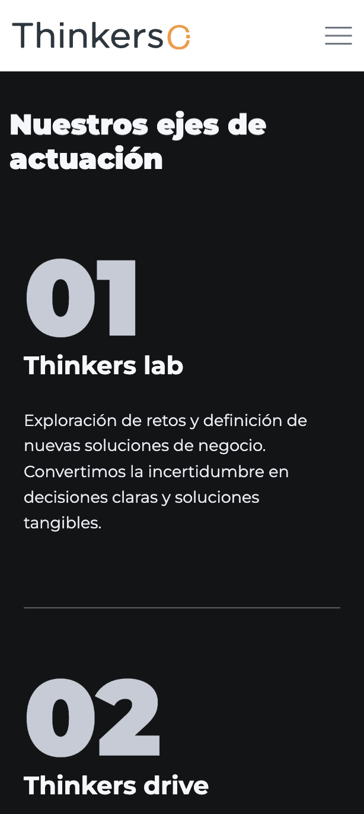
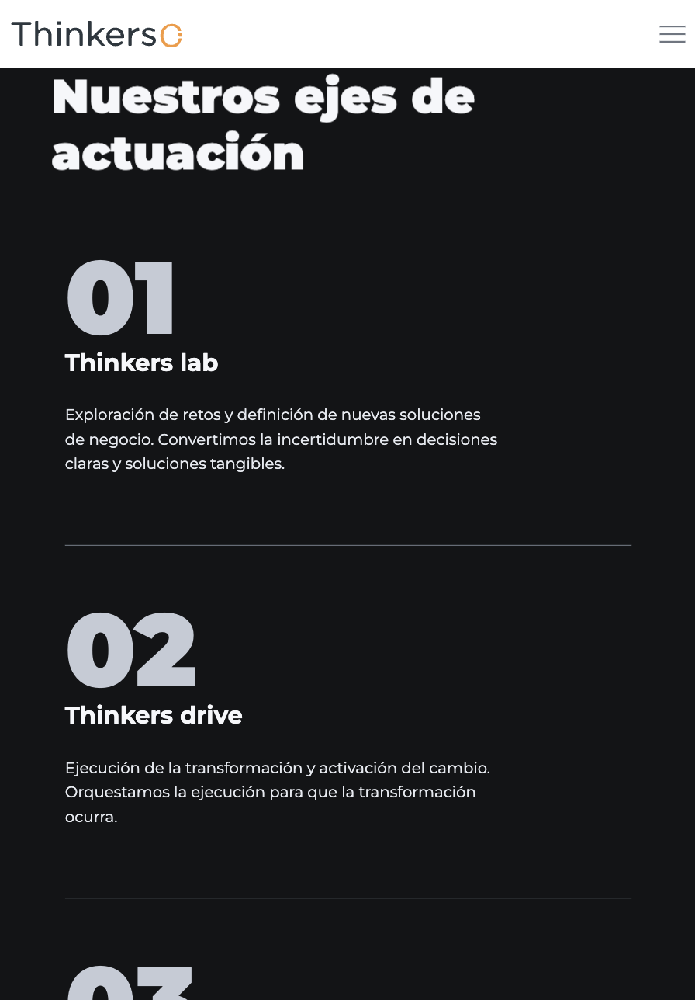
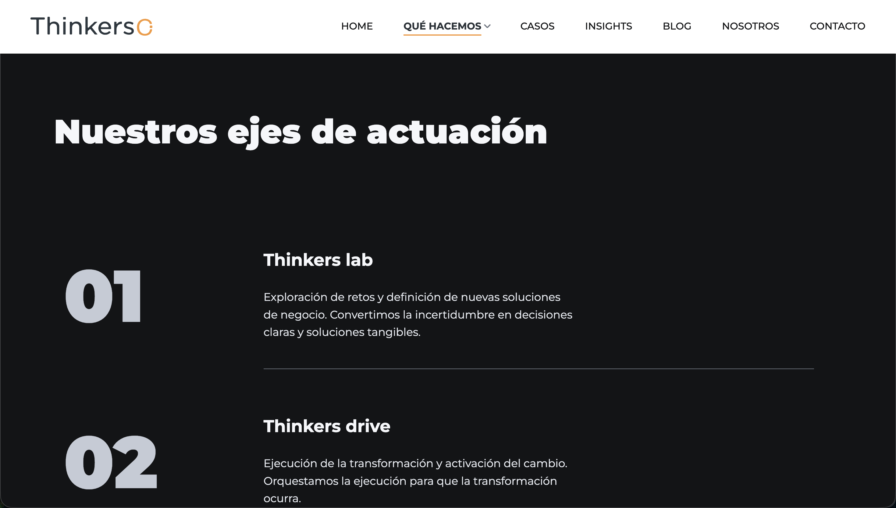

# Qué hacemos

# Índice
- [Qué hacemos](#qué-hacemos)
- [Índice](#índice)
  - [Descripción](#descripción)
  - [Tecnologías utilizadas](#tecnologías-utilizadas)
    - [Librerías y plugins](#librerías-y-plugins)
  - [Capturas de pantalla](#capturas-de-pantalla)
    - [Mobile](#mobile)
    - [Tablet](#tablet)
    - [Ordenador](#ordenador)
  - [Estructura relevante](#estructura-relevante)
  - [Estructura de la página](#estructura-de-la-página)
    - [1. Header / Navbar](#1-header--navbar)
    - [2. Ejes de actuación](#2-ejes-de-actuación)
    - [3. CTA (Call To Action)](#3-cta-call-to-action)
    - [4. Footer](#4-footer)
  - [Cómo añadir un nuevo eje de actuación](#cómo-añadir-un-nuevo-eje-de-actuación)
  - [Dependencias JS](#dependencias-js)
  - [Personalización](#personalización)
  - [Licencia](#licencia)

## Descripción

Página enfocada en explicar los servicios principales de la empresa a través de sus ejes de actuación, mostrando las diferentes áreas en las que trabaja el equipo.

Incluye:
- Navegación principal del sitio
- Sección de ejes de actuación con enlaces
- Sección CTA (Call To Action)
- Footer con información de contacto y redes sociales

---

## Tecnologías utilizadas

- HTML5
- CSS3
- JavaScript (vanilla + plugins)
- jQuery

### Librerías y plugins

- Bootstrap
- Swiper.js
- LightGallery
- GSAP (ScrollTrigger, ScrollSmoother, SplitText)
- Isotope

---
## Capturas de pantalla
### Mobile


### Tablet


### Ordenador


---

## Estructura relevante

```bash
assets/
 ├── css/
 │    ├── plugins/
 │    └── style.css
 └── js/
      ├── plugins/
      └── main.js
 
 que-hacemos.html  
```

---

## Estructura de la página

### 1. Header / Navbar

- Logo
- Menú de navegación principal

### 2. Ejes de actuación

- Título
- Listado de servicios principales
  - Thinkers lab
  - Thinkers drive
  - Thinkers capacity


### 3. CTA (Call To Action)

Sección para redirigir a contacto:

> Contáctanos →

### 4. Footer

- Información corporativa
- Redes sociales
- Contacto
- Navegación secundaria

---

## Cómo añadir un nuevo eje de actuación

Poner dentro del div: 
```html
<div class="cs_card_1_list">
```
el siguiente bloque:
```html
<a href="" class="cs_card cs_style_1 card_link cs_color_1 anim_div_ShowDowns">
    <div class="cs_card_left">
        <div class="cs_card_number cs_primary_font">
            Número
        </div>
    </div>
    <div class="cs_card_right">
        <div class="cs_card_right_in">
            <h2 class="cs_card_title">
                Título del eje
            </h2>
            <div class="cs_card_subtitle">
                Descripción del eje de actuación.
            </div>
        </div>
    </div>
</a>
```


---

## Dependencias JS

Incluidas al final del documento:

```
jquery-3.7.0.min.js
isotope.pkg.min.js
swiper.min.js
lightgallery.min.js
gsap + plugins
main.js
```

---

## Personalización

Se puede modificar:

- El contenido de la página → Editando los bloques HTML
- Los estilos → buscando las clases correspondientes en `assets/css/style.css`
- Las animaciones → `assets/js/main.js` + GSAP

---

## Licencia

Uso interno / proyecto corporativo Thinkers Co.