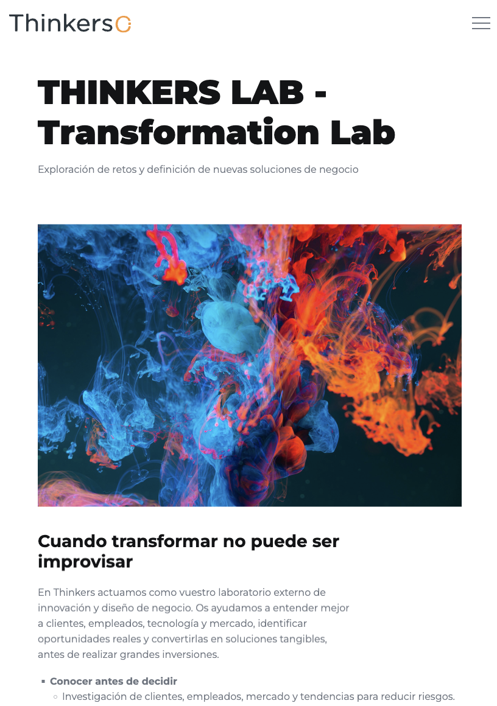
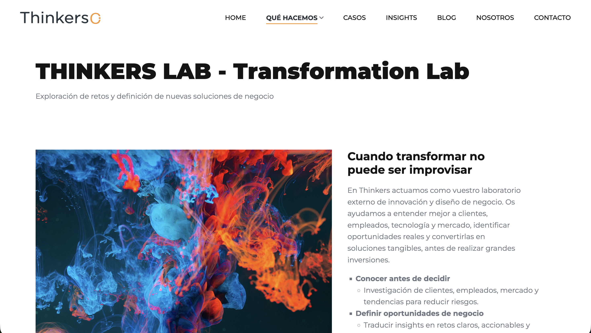

# Thinkers Lab / Thinkers Drive / Thinkers Capacity

# Índice
- [Thinkers Lab / Thinkers Drive / Thinkers Capacity](#thinkers-lab--thinkers-drive--thinkers-capacity)
- [Índice](#índice)
  - [Descripción](#descripción)
  - [Tecnologías utilizadas](#tecnologías-utilizadas)
    - [Librerías y plugins](#librerías-y-plugins)
  - [Capturas de pantalla](#capturas-de-pantalla)
    - [Mobile](#mobile)
    - [Tablet](#tablet)
    - [Ordenador](#ordenador)
  - [Estructura relevante](#estructura-relevante)
  - [Estructura de la página](#estructura-de-la-página)
    - [1. Header / Navbar](#1-header--navbar)
    - [2. Thinkers Lab / Thinkers Drive / Thinkers Capacity](#2-thinkers-lab--thinkers-drive--thinkers-capacity)
    - [3. Servicios](#3-servicios)
    - [4. Casos destacados](#4-casos-destacados)
    - [5. CTA (Call To Action)](#5-cta-call-to-action)
    - [6. Footer](#6-footer)
  - [Cómo añadir un nuevo servicio](#cómo-añadir-un-nuevo-servicio)
  - [Dependencias JS](#dependencias-js)
  - [Personalización](#personalización)
  - [Licencia](#licencia)

## Descripción

Páginas explicativas de Thinkers Lab / Thinkers Drive / Thinkers Capacity. Todas ellas comparten la misma estructura.

Incluye:
- Navegación principal del sitio
- Título y descripción del eje
- Servicios realizados
- Casos destacados
- Sección CTA (Call To Action)
- Footer con información de contacto y redes sociales

---

## Tecnologías utilizadas

- HTML5
- CSS3
- JavaScript (vanilla + plugins)
- jQuery

### Librerías y plugins

- Bootstrap
- Swiper.js
- LightGallery
- GSAP (ScrollTrigger, ScrollSmoother, SplitText)
- Isotope

---
## Capturas de pantalla
### Mobile


### Tablet


### Ordenador


---

## Estructura relevante

```bash
assets/
 ├── css/
 │    ├── plugins/
 │    └── style.css
 └── js/
      ├── plugins/
      └── main.js
 
thinkers-lab.html
```

---

## Estructura de la página

### 1. Header / Navbar

- Logo
- Menú de navegación principal

### 2. Thinkers Lab / Thinkers Drive / Thinkers Capacity

- Título
- Pequeña descripción
- Imagen
- Título de sección y descripción

### 3. Servicios
Listado de servicios relacionados con Thinkers Lab / Thinkers Drive / Thinkers Capacity

### 4. Casos destacados
Listado de los 3 casos más destacados de Thinkers co.
Incluye un botón "Ver todos los casos" para ir a la página ``casos/index.html``, donde se listan todos los casos realizados.

### 5. CTA (Call To Action)

Sección para redirigir a contacto:

> Contáctanos →

### 6. Footer

- Información corporativa
- Redes sociales
- Contacto
- Navegación secundaria

---

## Cómo añadir un nuevo servicio

Poner dentro del conjunto de divs: 
```html
<!-- start servicios -->
        <div>
          <div class="cs_work cs_work_1">
            <div class="cs_card_work cs_style_1">
```
el siguiente bloque:
```html
<div class="cs_card cs_mt_nthchild_0 anim_div_ShowLeftSide">
    <div class="cs_card cs_style_1">
        <div class="cs_stroke_number">
        <span>Número</span>
        </div>
    </div>
    <h6 class="cs_work_title">Título</h6>
    <p class="cs_work_subtitle">
        Descripción
    </p>
    </div>
```


---

## Dependencias JS

Incluidas al final del documento:

```
jquery-3.7.0.min.js
isotope.pkg.min.js
swiper.min.js
lightgallery.min.js
gsap + plugins
main.js
```

---

## Personalización

Se puede modificar:

- El contenido de la página → Editando los bloques HTML
- Los estilos → buscando las clases correspondientes en `assets/css/style.css`
- Las animaciones → `assets/js/main.js` + GSAP

---

## Licencia

Uso interno / proyecto corporativo Thinkers Co.